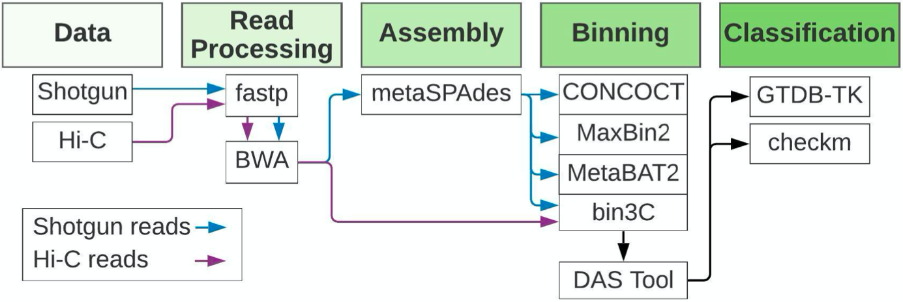
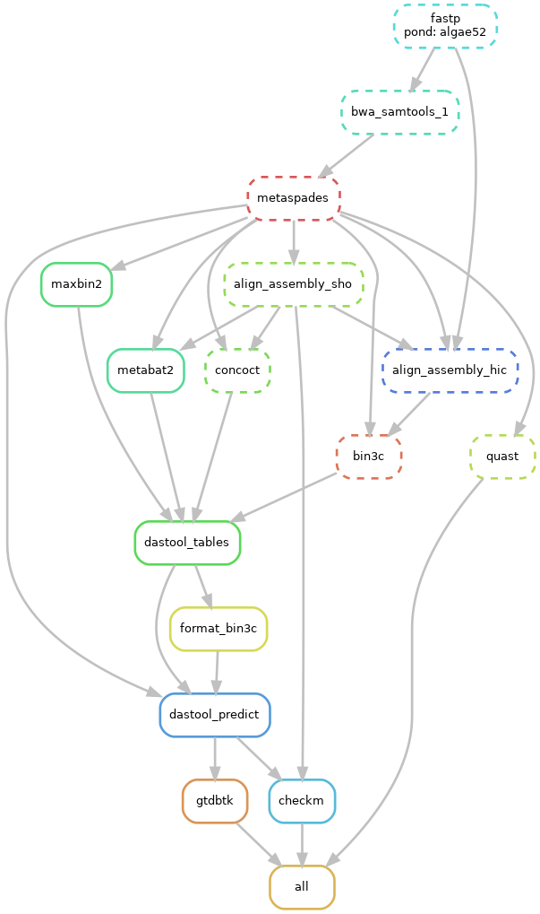
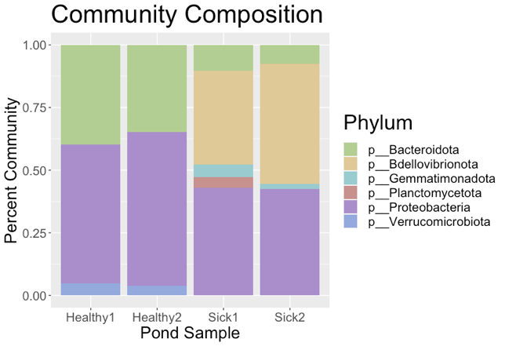

# Metagenomic pipeline using Shotgun and Hi-C reads

## Function
This pipeline is based in Snakemake and analyzes a multi-sample metagenomic dataset of FASTQ reads, ultimately outputting graphs of both the taxonomic community profile and percentage abundances of species present. Here we showcase our pipeline through an analysis identfying a novel algal pathogen from algal-pond matagebomic samples.

## Repository Layout
* The folder `pipeline` contains the snakemake-mediated pipeline used in our analysis. For a generalized pipeline that you can use, see the section "Try it yourself"
* The folder `results` contains a graphic of the final quantified classification barcharts produced by this analysis (`top_6_phyla.png`) as well as a write-up summary of our analysis(`Writeup.pdf`).

## Motivation
Metagenomics poses unique and challenging problems in comparison to the standard study of single organism datasets, for which most sequencing platforms are designed. Hi-C proximity ligation allows for improved deconvolution of metagenomic sequencing data by providing information about the co-localization of sequences within a single cell. 

## Example Data Overview
The data used in this pipeline consists of four samples of FASTQ read data of the algal species *Nannochloropsis oceanica*. *N. oceanica* is of significant interest as an alternative energy source due to its high lipid content and minimal growth requirements. However, *N. oceanica* is easily susceptible to infection by microscopic pathogen(s) that are not yet identified. By using metagenomic techniques and leveraging the increased deconvolutional power of Hi-C, we can identify the organisms present in algal ponds. We are studying four samples, two of which represent healthy ponds, and two that represent sick ponds that are no longer viable for energy production. In this project we aim to identify the species present in each of the ponds, and upon comparison of the healthy and sick ponds, identify the possible pathogen(s).

### Pipeline

Our Snakemake pipeline processes FASTQ reads from both Illumina short-read sequencing and Hi-C sequencing to determine taxonomic and species abundances in each sample. The pipeline is divided into five main steps: Data, Read Processing, Assembly, Binning, Classification. A visual representation of our pipeline is shown below. The boxes under each step show the relevant tools used.

## Example output

A DAG is automatically produced through Snakemake and offers another way to visualize the steps of our pipeline. The DAG for the *N. oceanica* metagenomic pipeline is shown below, featuring only one of our samples, "algae52", for simplicity, although our script can accomodate multiple sample. The dotted lines denote those tasks which have already been completed at the time of creating the DAG image. 

After classification, we developed an R Shiny script to visualize our results. The percent community composition for each pond is shown below. Notably, we see that sick ponds display a substantial abundance (~33%) of the phylum Bdellovibrionota, which is not observed in healthy ponds. This finding suggests that Bdellovibrionota is detrimental to algal pond health.

## Future Directions
In order to make this pipleine usable for other metagenomic datasets, we aim to create an open-source UI that allows for input of the number of samples, the conditions of each sample, and the types of read data. The user will be able to recreate a similar metagenomic analysis by downloading the Snakemake pipeline and the required environments.

## Try it yourself
A generalized pipeline may be found here:
https://github.com/Jonasgrove/meta_compare

## Acknowledgements
All FASTQ data is provided by Los Alamos National Lab through the University of Arizona. This project was created at the University of Oregon. 
